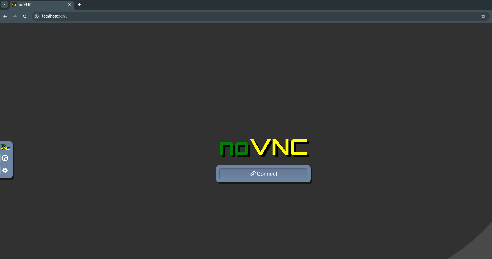
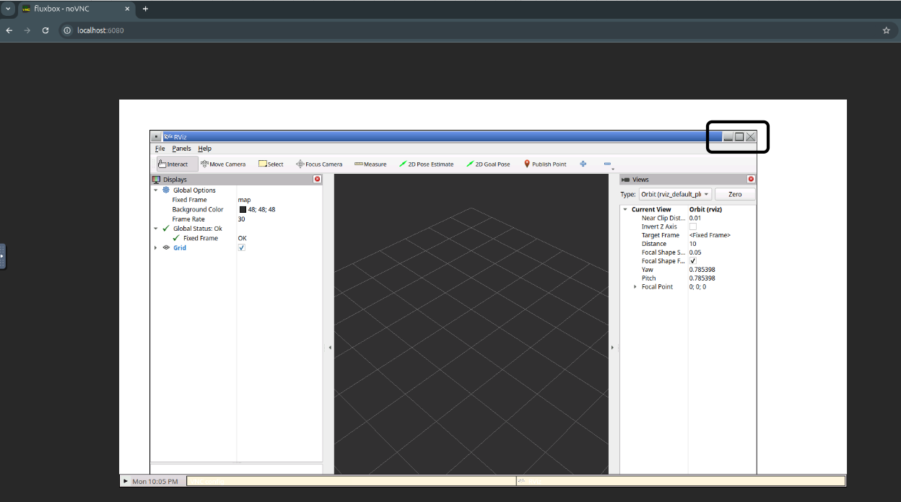
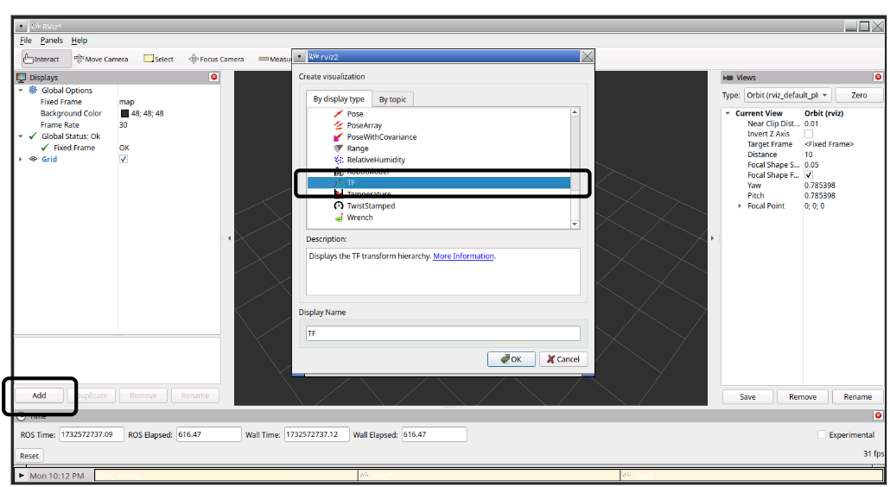
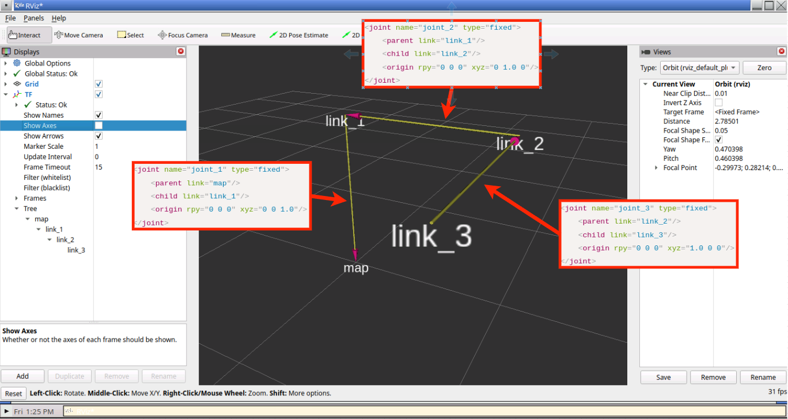
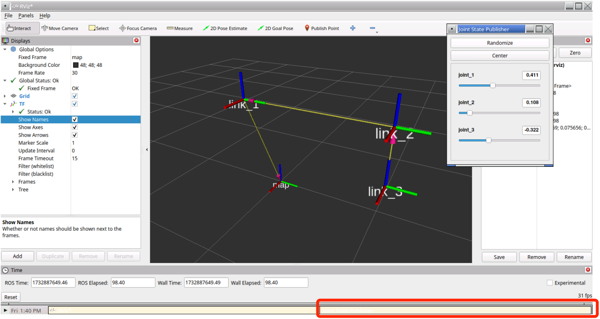
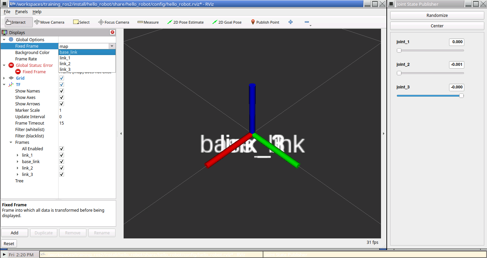
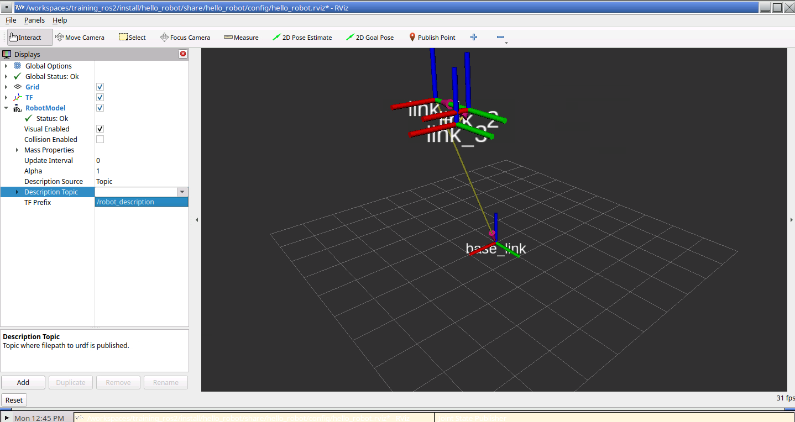
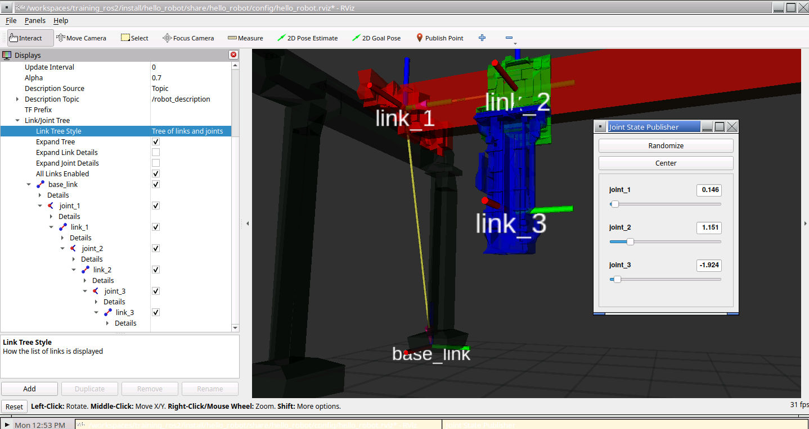
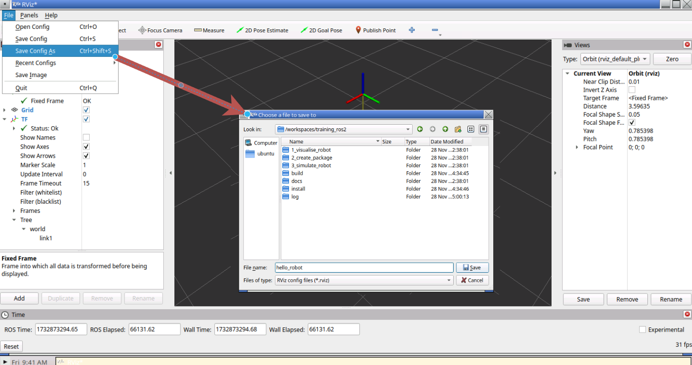

[< Back to homepage](../README.md) 

<!-- omit from toc -->
# Visualise a robot

**Table of content**
- [URDFs](#urdfs)
- [Running ROS 2 executables](#running-ros-2-executables)
- [Analysing ROS 2 processes](#analysing-ros-2-processes)
  - [Using command line helper functions](#using-command-line-helper-functions)
  - [Using RViz built-in visualisation GUI](#using-rviz-built-in-visualisation-gui)
- [Understanding the robot description](#understanding-the-robot-description)
  - [Joint state publisher GUI](#joint-state-publisher-gui)
- [Compiling and running a third-party package](#compiling-and-running-a-third-party-package)
- [Changing an existing package](#changing-an-existing-package)

## URDFs

In this exercise we'll show you how to visualize a super simple robot!

In the folder `1_visualise_robot` you can find the file `my_robot_fixed.urdf` as a URDF file, the Unified Robot Description Format. This xml file schema is used by ROS for representing any sort of robot models. Here it is for reference:

``` xml
<?xml version="1.0" ?>
<robot name="simple_robot">
    <link name="map" />
    <link name="link_1" />
    <link name="link_2" />
    <link name="link_3" />

    <joint name="joint_1" type="fixed">
        <parent link="map"/>
        <child link="link_1"/>
        <origin rpy="0 0 0" xyz="0 0 1.0"/>
    </joint>

    <joint name="joint_2" type="fixed">
        <parent link="link_1"/>
        <child link="link_2"/>
        <origin rpy="0 0 0" xyz="0 1.0 0"/>
    </joint>

    <joint name="joint_3" type="fixed">
        <parent link="link_2"/>
        <child link="link_3"/>
        <origin rpy="0 0 0" xyz="1.0 0 0"/>
    </joint>

</robot>
```

This file represents a collection of `links` and `joints` root elements, which are respectively the rigid parts (links) and the moving parts (rotary and linear actuators) of the robot. All these elements can be given an arbitrary name as an attribute.\
The `parent` and `child` elements inside of joints elements define the hierarchy of the kinematic chain, telling ROS 2 kinematic solvers how to build the robot. Moreover, in such simple case, we only used `"fixed"` supported value for the attribute `type`, which identifies which kind of connection the links share. The supported values here are:

- **Fixed** - Link are rigidly connected, also used as positioning aids for different robot parts mounted together.
- **Revolute** - A rotational motion, with minimum/maximum angle limits.
- **Continuous** - A rotational motion with no limit, e.g. a wheel.
- **Prismatic** - A linear sliding motion, with minimum/maximum position limits. [^ready_urdf]

Finally, the bare minimum element necessary to visualise such simple robot in ROS 2 is the joints' `origin`. This element contains the linear and rotational distances, telling the joint (an the child link attached to it) where its position is w.r.t the parent link zero frame. 

Ideally, this is all you need to write yourself in order to describe your very own custom robot.

## Running ROS 2 executables
Now we are ready to visualise this simple robot chain:
- **Open a new terminal by pressing** ``` Ctrl+Shift+` ```**, or selecting** `Terminal` -> `New Terminal` **in the top menu bar.**
- **Then execute this command by copy pasting it in the terminal and hitting enter:**
```sh
ros2 run robot_state_publisher robot_state_publisher 1_visualise_robot/simple_robot_fixed.urdf
```

You should see this result:
```sh
[WARN] [###] [robot_state_publisher]: No robot_description parameter...
[INFO] [###] [robot_state_publisher]: Robot initialized
```

We are calling a `ros2` executable with the `run` command. The pre-compiled package called by ROS 2 is called `robot_state_publisher`, which then requires as argument the name of the actual executable, also called `robot_state_publisher`. Finally, we trail the whole command line instruction with the path to the `urdf` file we want to visualize mentioned before. The `WARN` message is actually telling us that calling a `.urdf` file directly is being deprecated. No worries about that, for now!

## Analysing ROS 2 processes
### Using command line helper functions
Until the terminal where `robot_state_publisher` was executed is kept alive (aka "stays open"), ROS is going to be running it. And it is made very easy to check what it is doing!

- **Open a new terminal in VSCode, as explained above.**
- **Execute the command below**:
```sh
ros2 topic list -v
```

The result will look like:
```sh
Published topics:
 * /parameter_events [rcl_interfaces/msg/ParameterEvent] 2 publishers
 * /robot_description [std_msgs/msg/String] 1 publisher
 * /rosout [rcl_interfaces/msg/Log] 2 publishers
 * /tf [tf2_msgs/msg/TFMessage] 1 publisher
 * /tf_static [tf2_msgs/msg/TFMessage] 1 publisher

Subscribed topics:
 * /joint_states [sensor_msgs/msg/JointState] 1 subscriber
 * /parameter_events [rcl_interfaces/msg/ParameterEvent] 2 subscribers
```
What you see in this list above are the standard `messages`, and the custom interfaces messages, that the `robot_description` package is sending (as a _publisher_) and that it is expecting to receive (as a _subscriber_).
Each message is transferred via a specific named `topic`, e.g. `/tf` for the transforms representing the robot kinematic chain, and `/joint_states` for the position of each robot joint.  

### Using RViz built-in visualisation GUI
Now it is time to run another process to launch the ROS visualisation GUI, RViz!

- **In the newly created terminal, type** `rviz2` **and hit enter**.
- **In any web browser, navigate to** http://localhost:6080". **On the webpage, click the** `🔗Connect` **button. You will see RViz already running on the remote linux machine connection.**
- To better see all the RViz GUI interface, you can enlarge the window to full screen within the webpage. 
- **In the left column tab, look for the** `Add` **button, and in the pop-up windows that will appear, scroll down and select** `TF`.
  
The robot will now appear, rendered by `RViz` by subscribing to that existing topic called `/tf` shown in the `ros2 topic list` command line output above. This is showing us that the the `robot_state_publisher` is working as expected!

<p align="center">

</p>
<p align="center">

</p>
<p align="center">

</p>

## Understanding the robot description
The robot that appears on screen has 4 transform frames, one for each link origin. Their positioning in space w.r.t the absolute zero (in this case called `map`) is dictated by the joints origin values, which sequentially shift the links respecting the kineamtic series, also called `Tree` on the left hand-side panel.

<p align="center">

</p>

This robot is not capable of moving any of the joints, beaing of type `"fixed"` all of them. If we were to add linear motions, like on a gantry type of mechanism, we would need to replace the `"fixed"` joint type with the `"prismatic"` type. 

When defining moving joint, the axis direction of the linear actuator (or axis of rotation, if it were a `"revolute"` joint) must be given with the `axis` element in the urdf, as well as the joints travel limits, as shown below:
```xml
<axis xyz="1 0 0"/>
<limit lower="0" upper="1.0" velocity="1.0" effort="0" />   
```
Failing to do so will make the `robot_state_publisher` fail to load the kinematic chain.

- **In VSCode, focus on the first terminal that was opened** (there should be a list of terminals on the right-hand side [like so](https://code.visualstudio.com/docs/terminal/basics#_managing-terminals)).
- **Press** `Ctrl + C` **in order to stop the** `robot_state_publisher`.
- **Launch the alternative urdf description, with prismatic joints:**
  
```sh
ros2 run robot_state_publisher robot_state_publisher 1_visualise_robot/simple_robot_prismatic.urdf
```

- **Going back on the web browser showing the RViz GUI, remove the TF entry that we added before in the `display` panel on the left.**
- **Now add it again to refresh the TF with the new description and ...**

> **:warning:** At first, the robot seems to be exactly the same!

In reality, no robot should be even be shown! Because, with moving joints now present in the description, the robot state publisher requires a `joint state` topic publisher as a must, to actively send information about the actuators positions! The reason why the previous robot is still visible is unknown at the moment (just a bug!).

>  **:information_source:** Then, how can we test if our robot is capable of moving and that it behaves as we would expect?

### Joint state publisher GUI
Likely, ROS 2 package `joint_state_publisher` comes with a nice GUI tool, which was pre-installed in the container workspace for this training.

- **Open a third terminal alongside the other executables and run:**
```sh
ros2 run joint_state_publisher_gui joint_state_publisher_gui
```

The linux remote desktop rendered by the web browser will show a new window with an intractable slider for each joint published by the robot description, with limits as defined on the urdf file.

> **:information_source:** If you cannot see the window, or if you lose focus on it and it disappears, just press on the bottom task bar on the right, as indicated by the red box in the picture below.

<p align="center">

</p>

Feel free to play around with the sliders of the new GUI, or even the axis and limits of the joints defined in the `simple_robot_prismatic` description.

- When you are done, just kill all running node, or just close all terminals.

<!-- ## FEATURE: Publishing on the robot joint state direclt frmo the cli instead of using the GUI -->

## Compiling and running a third-party package
ROS enables users to create their own packages and provides the infrastructure to do all the configuring and launching of executables with a single input, avoiding all the tedious manual steps we have just shown. It does so with the use of the compiling tool `colcon`, shipped together with ROS 2 for users to create extra packages and extensions capable of anything they might wish for, provided the code can be compiled!

In the folder `1_visualise_robot/src` all the required build files are already provided, as `CMakeLists.txt` and `package.xml` files. These are used to set the name of the new executable (`hello_robot` in this case), as well as to declare the required ROS 2 pre-installed binary packages that colcon will have to compile against.

The folder `urdf` contains the unified robot description format file/s the package is going to use. In this case, the file called `../1_visualise_robot/src/urdf/my_robot.urdf` was directly copied from the official SAMXL gantry robot description, with the data for the first 3 prismatic joints.

The folder `launch` contains the configuration file `../1_visualise_robot/src/launch/hello_robot.xml`, which will be used by the package to tell the computer which combination of ROS 2 and third-party packages to start at once:
```xml
<launch>
  <!-- Argument to enable GUI -->
  <arg name="joint_gui" default="true"/>

  <!-- Robot State Publisher -->
  <node pkg="robot_state_publisher" exec="robot_state_publisher" output="screen">
    <param name="robot_description"
      value="$(command 'cat $(find-pkg-share hello_robot)/urdf/my_robot.urdf')" />
  </node>

  <!-- RViz -->
  <node pkg="rviz2" exec="rviz2" args="-d $(find-pkg-share hello_robot)/config/hello_robot.rviz" />

  <!-- Joint State Publisher GUI (conditional) -->
  <group if="$(var joint_gui)">
    <node pkg="joint_state_publisher_gui"
      exec="joint_state_publisher_gui"
      output="screen" />
  </group>
</launch>
```

In our case, we would like to have a `robot_state_publisher` node launched, sourcing the urdf file within the `urdf` folder of the package itself. Hence, the embedded command line `cat $(find-pkg-share hello_robot)` will automatically source the compiled package and find the folder path for us. 
We also launch `rviz2` by default, while the `joint_state_publisher_gui` node is launched based on a conditional argument named `"joint_gui"`, which is true by default. This will make the launching process faster and more reproducible.

First of all, we shall compile everything:
- **Simply open a new terminal in VSCode and execute:**
```sh
colcon build --symlink-install --packages-up-to hello_robot
``` 

Three new folders are going to be created, called `build`, `install` and `log`.
The output should look something like this:
```sh
ubuntu@f6cc1a723077:/workspaces/training_ros2$ colcon build --symlink-install --packages-up-to hello_robot

Starting >>> hello_robot
Finished <<< hello_robot [1.26s]                  

Summary: 1 package finished [1.40s]
```

- **Source the newly compiled ROS 2 package:**
```sh
source install/setup.bash
```

- **And use the** `launch` **method to call all the executables defined in the** `.xml` **file at once:**
```sh
ros2 launch hello_robot hello_robot.xml
```
- **Add the** `TF` **panel inside the new Rviz window opened on the web browser and...**

> **:warning:** Some warnings appears, saying:  `Frame [map] does not exist`.

In reality the robot description is loaded correctly, and even the joints GUI is showing sliders ready to be used. The reason for the problem is because RViz comes with a pre-defined `Fixed Frame` set to `map` in the global options panel on the left, something left over by the success of mobile robots, which use the name `map` as the zero default frame name when publishing SLAM maps.
For robot manipulators, such nomenclature makes little sense, so the frame `base_link` is created instead as the zero reference frame of the robot kinematic chain (usually corresponding to the robot mounting on the floor)[^rep-0199].

- **In the** `Global Options` **of the left panel, click on the Fixed Frame drop-down menu and select the robot published fixed frame** `base_link` **instead of the default** `map`:

<p align="center">

</p>

The robot transforms will appear on screen! Now we can show the model of the robot as well:

- **With the** `Add` **button in the** `Displays` **panel on the left, add a** `RobotModel` **RViz default plugin, in the same way the** `TF` **was added.**
- **In the** `Description Topic` **drop-down filed of the new disaply plugin, select the topic** `/robot_description`:

<p align="center">

</p>

You will finally get a nice looking virtual model of SAM XL gantry robot, with functioning prismatic joints and a nice looking interface on RViz. Feel free to play with the limited amount of customizations available to show the robot, the joint axis and link transforms, etc.

<p align="center">

</p>

## Changing an existing package

We can modify this package in order to do all these settings above for us automatically at the next launch. 
Lets make the following changes to get the desired behaviour:
- **Inside** `../1_visualise_robot/src/`**, create a new folder called** `config` **using VSCode.**
- **Back in the RViz2 web interface, select** `File` -> `Save Config As`...
- **In the new file saving windows, navigate to the folder** `/workspaces/training_ros2/1_visualise_robot/src/config`.
- **Give the file a name, like** `hello_robot`**, and hit save:**

<p align="center">

</p>

This file will contain all the settings in the current RViz panels, drop-downs and viewport camera angle. In this way, you can control exactly how the GUI will look like next time you launch it. Finally, to make this work, we will have to add the file to the build settings and build again:

- **Open the file** `../1_visualise_robot/src/CMakeLists.txt` **in VSCode.**
- **Change line number 9 from** ```install(DIRECTORY launch urdf``` **to** ```install(DIRECTORY launch urdf config```
- **Stop the running process in the active terminal to quit the current ROS 2 executables.**
- **Compile, source and execute the package again in a single line of code, with:**
```sh
colcon build --symlink-install --packages-up-to hello_robot && source install/setup.bash && ros2 launch hello_robot hello_robot.xml
```

[^ready_urdf]: [ROS on DDS at *https://articulatedrobotics.xyz/tutorials/ready-for-ros/urdf/*](https://articulatedrobotics.xyz/tutorials/ready-for-ros/urdf/)
[^rep-0199]: [rep-0199: Coordinate Frames for Serial Industrial Manipulators](https://gavanderhoorn.github.io/rep/rep-0199.html)

[Go to chapter 2 =>](2%20-%20create%20package.md) 

