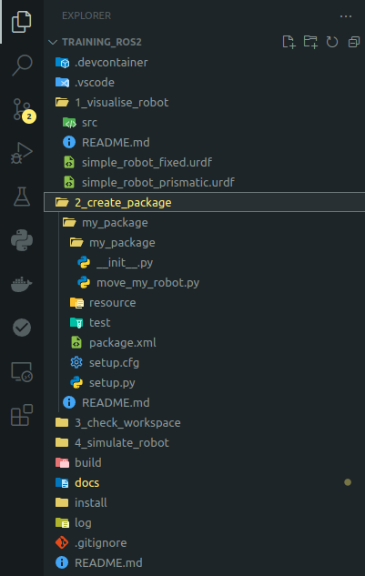

**[< Back to homepage](../README.md)**
**[< Back to chapter 1](1%20-%20visualise%20robot.md)**

<!-- omit from toc -->
# Creating a package

**Table of content**
- [What makes up a ROS 2 package?](#what-makes-up-a-ros-2-package)
- [Adding python programmatic launch files](#adding-python-programmatic-launch-files)
- [Adding dependencies and resources to a ROS 2 python package](#adding-dependencies-and-resources-to-a-ros-2-python-package)
- [Execution of the package](#execution-of-the-package)
- [Adding a publisher node for the joint states](#adding-a-publisher-node-for-the-joint-states)
- [Make the robot move using our custom joint publisher package](#make-the-robot-move-using-our-custom-joint-publisher-package)


## What makes up a ROS 2 package?
ROS 2 can generate boilerplate files for both Python and C++ packages, creating all minimum required contents for each programming language at one line of command away.
Before proceeding, it is worth showing ROS 2 default packages folder structures[^ros2_pkg]:

```sh
# Python folder structure
py_package/
    package.xml
    resource/py_package_1
    setup.cfg
    setup.py
    py_package_1/
# C++ folder structure
cpp_package/
    CMakeLists.txt
    include/cpp_package_n/
    package.xml
    src/
```
The `hello_robot` package showed in the previous chapter is not respecting this structure strictly, but that is only for clarity of this training. The standards should always be respected, especially for future clarity and reusability of the code itself.

- **In the VSCode terminal inside the devcontainer, type the following commands:**
```sh
ros2 pkg create --destination-directory 2_create_package --build-type ament_python --node-name my_package my_package
```
This command is going to create a new ROS 2 package in the chapter 2 folder, thanks to the option `--destination-directory 2_create_package`. It will create the Python language boilerplate files with the option `--build-type ament_python`.
Finally it will give the package the name `my_package`, with a pre-filled python script file, declaring a node called `my_package`.

Your VSCode file explorer should look something like this now:
<p align="center">

</p>

Let's test our new package by building it in the same environment where we built the `hello_robot` package before and launching the node manually.

- **Execute the following commands in order in the same terminal as before:**
```sh
colcon build --packages-up-to my_package --symlink-install
source install/local_setup.bash
ros2 run my_package my_package
```

Although we do not have a launch file setting yet, we can run the new executable directly with `ros2 run` in the terminal. You will see the output in the comand line `Hi from my_package.`
The `colcon` command, as before, will build only the package you mention in the option `--packages-up-to`, plus its dependencies. 


## Adding python programmatic launch files
ROS 2 comes with many ways of launching nodes and executable. We have seen the `.xml` format, but also `.yaml` and `.launch.py` exisit, with the latter becoming the most common among them within ROS 2.
This launch file is in reality a python script itself, which can offer even more conditional and parametric launch conditions for your set of packages, libraries and executables.

As next challenge, lets try to launch the python greeting script and the `hello_robot` description from within this same package:

- **In the** `../2_create_package/my_package/` **folder, create a new folder called** `launch`**, and a file within it called** `hello_robot.launch.py`
- **Open this file and copy paste this content[^ros2_launch_tut]:**

```py
from launch import LaunchDescription
from launch.actions import IncludeLaunchDescription, DeclareLaunchArgument
from launch.launch_description_sources import AnyLaunchDescriptionSource
from launch.substitutions import PathJoinSubstitution, LaunchConfiguration
from launch_ros.substitutions import FindPackageShare
from launch_ros.actions import Node


def generate_launch_description():
    declared_arguments = []
    include_launch = []
    
    declared_arguments.append(
        # Declare the joint_gui argument
        DeclareLaunchArgument(
            "joint_gui",
            default_value="false",
            description="Enable joint state publisher GUI"
        )
    )
    
    # Path to the external XML launch file
    external_package_launch_path = PathJoinSubstitution(
        [FindPackageShare("hello_robot"), "launch", "hello_robot.xml"]
    )

    include_launch.append(
        IncludeLaunchDescription(
            AnyLaunchDescriptionSource(external_package_launch_path),
            launch_arguments={
                "joint_gui": LaunchConfiguration("joint_gui")}.items()
        )
    )

    return LaunchDescription(declared_arguments + include_launch)

```

This script will tell ROS 2 to look for a package called `"hello_robot"`, and specifically for the `.xml` launch file in its folders, and then use such launch description as if it was part of the new package `my_package`. 
In this way, we will be able to launch additional executables, scripts and nodes from existing packages, reusing 100% of previously written code, as we will show shortly!
Also, the argument `"joint_gui"` is passed, with its default value `false`, therefore not showing the joint publisher GUI unless we state differently.

## Adding dependencies and resources to a ROS 2 python package
Now that we want to call nodes from other packages, we have to add a few settings to the colcon build steps. We can do this by modifying the `my_package` settings contained in the `package.xml` file to add the dependency to the existing `hello_robot` package, like so (➤):

````xml
<?xml version="1.0"?>
<?xml-model href="http://download.ros.org/schema/package_format3.xsd" schematypens="http://www.w3.org/2001/XMLSchema"?>
<package format="3">
    <name>my_package</name>
    <version>0.0.0</version>
    <description>TODO: Package description</description>
    <maintainer email="***">ubuntu</maintainer>
    <license>TODO: License declaration</license>

    <test_depend>ament_copyright</test_depend>
    <test_depend>ament_flake8</test_depend>
    <test_depend>ament_pep257</test_depend>
    <test_depend>python3-pytest</test_depend>

➤➤➤➤<depend>hello_robot</depend>

    <export>
        <build_type>ament_python</build_type>
    </export>
</package>
````
And in the `setup.py` file we will have to do the same, plus add the existence of the launch script in the launch folder, like so (➤):
```py
from setuptools import find_packages, setup

package_name = "my_package"

setup(
    name=package_name,
    version="0.0.0",
➤➤➤➤packages=find_packages(["hello_robot"], exclude=["test"]),
    data_files=[
        ("share/ament_index/resource_index/packages", ["resource/" + package_name]),
        ("share/" + package_name, ["package.xml"]),
➤➤➤➤➤➤➤➤("share/" + package_name + "/launch", ["launch/hello_robot.launch.py"]),
    ],
    install_requires=["setuptools"],
    zip_safe=True,
    maintainer="ubuntu",
    maintainer_email="e.bernardi@tudelft.nl",
    description="TODO: Package description",
    license="TODO: License declaration",
    tests_require=["pytest"],
    entry_points={
        "console_scripts": ["move_my_robot = my_package.move_my_robot:main"],
    },
)
```

## Execution of the package
- **Now that all the required compile settings are in place, execute again the commands:**

```sh
colcon build --symlink-install --packages-up-to my_package
source install/setup.bash
ros2 launch my_package hello_robot.launch.py 'joint_gui':=true
```

<!-- **TODO**: remove pysetuptools warning with either:
PYTHONWARNINGS="ignore:setup.py install is deprecated::setuptools.command.install" or Downgrading the setuptools to older version 58.2.0, -->

You should notice that the package `hello_robot` is also compiled in the colcon build call, as it is declared as a dependency of `my_package` now!

In case you are not sure how to pass arguments to launch files, you can always run :
```sh
ros2 launch my_package hello_robot.launch.py --show-args
```
And get:
```sh
Arguments (pass arguments as '<name>:=<value>'):
    'joint_gui':
        Enable joint state publisher GUI
        (default: 'false')
```

## Adding a publisher node for the joint states
Now let's make the gantry robot do some more interesting motions guided by the python ROS 2 node instead of the joint publisher GUI!
Once we directly publish joint states to the robot from a python script, we can do motion control via the power of math!

- **Inside VSCode, open the file** `../2_create_package/my_package/my_package/my_package.py`
- **Select all and copy paste the following, overwriting the default node code:**

```py
import rclpy
from rclpy.executors import ExternalShutdownException
from rclpy.node import Node
from sensor_msgs.msg import JointState
import math

from std_msgs.msg import String

class MinimalJointPublisher(Node):

    def __init__(self):
        super().__init__('minimal_joint_publisher')
        
        timer_freq = 50 # Frequency of message publication (Hz)
        self.sine_frequency = 1/10  # Frequency of the sine wave (Hz)
        # self.start_time = self.get_clock().now()
        self.counter = 0.0
        
        self.joint_publisher = self.create_publisher(JointState, 'joint_states', 10,)
        self.joint_names = ['joint_1', 'joint_2', 'joint_3']
        self.joint_ranges = [(0.0, 9.0), (0.0, 7.15), (-2.0, 0.0)]  # (min, max) for each joint
        
        # Timer to control the publishing rate
        self.timer = self.create_timer(1.0/timer_freq, self.timer_callback)

    def timer_callback(self, ):
        # Calculate the simulated time
        # elapsed_time = (self.get_clock().now() - self.start_time).to_msg().nanosec / 1e9
        
        msg = JointState()
        msg.name = self.joint_names
        
        joint_values = []
        for min_val, max_val in self.joint_ranges:
            # Generate a sinusoidal value within the range [0,1]
            base_value = 0.5 + 0.5 * math.sin((2 * math.pi * self.sine_frequency) * (self.get_clock().now().nanoseconds / 1e9))
            # Scale it between min and max of each joint
            scaled_value = min_val + base_value * abs(max_val - min_val)
            joint_values.append(scaled_value)
            
        msg.position = joint_values
        msg.header.stamp = self.get_clock().now().to_msg()
        self.get_clock().now()
        
        self.joint_publisher.publish(msg)
        self.counter += 0.1

def main(args=None):
    rclpy.init(args=args)  # Initialize rclpy
    minimal_publisher = MinimalJointPublisher()

    try:
        rclpy.spin(minimal_publisher)
    except (KeyboardInterrupt, ExternalShutdownException):
        pass
    finally:
        # Clean up and shut down rclpy
        minimal_publisher.destroy_node()
        rclpy.shutdown()

if __name__ == '__main__':
    main()
```

- **Compile and source the package again.**
```sh
colcon build --symlink-install --packages-up-to my_package
source install/setup.bash
```
- **Execute the new** `MinimalJointPublisher` **node within** `my_package.py` **with the comand line:**
```sh
ros2 run my_package my_package
```
- **Open a new terminal in the VSCode and execute:**
```sh
ros2 topic list
```
This will show all the running nodes with their publishing topics. You should see `/joint_states` in the list.

- **In that same terminal, execute:**
```sh
ros2 topic echo /joint_states
```

The output should change continuously, according to the sinusoidal decalred in the `MinimalJointPublisher` node:
```py
# Generate a sinusoidal value within the range
base_value = (math.sin(self.counter) + 1) / 2  # Normalize sin to [0, 1]
scaled_value = min_val + base_value * (max_val - min_val)
```

In a predefined format dictated by the ROS 2 joint topic message:
```sh
---
header:
  stamp:
    sec: 1733496517
    nanosec: 590228579
  frame_id: ''
name:
- joint_1
- joint_2
- joint_3
position:
- 0.5397921062097357
- 0.4288348399332901
- -1.8800461986200587
velocity: []
effort: []
---
```


<!-- > **:warning:** It is good practice to always give your custom topics a very clear, customised name, in order to identify it quickly and not confuse it with existing one by default in ROS 2.

> **:information_source:** This is true apart for the `joint_states` topic, which is usually kept as a unique name, even if multiple robot descriptions are loaded simultaneously. This way, the joint state publish GUI can also work at the same time. To distingush between joints numbers of different robots, a unique prefix is added to the robot description name. -->


## Make the robot move using our custom joint publisher package
In order to run everything together, we can simply add the node `MinimalJointPublisher` as a ROS 2 executuable in the launch file.

- **Simply add the following lines (➤) in the `hello_robot.launch.py` file:**

```python
from launch import LaunchDescription
from launch.actions import IncludeLaunchDescription, DeclareLaunchArgument
from launch.launch_description_sources import AnyLaunchDescriptionSource
from launch.substitutions import PathJoinSubstitution, LaunchConfiguration
from launch_ros.substitutions import FindPackageShare
➤➤ from launch_ros.actions import Node


def generate_launch_description():
    declared_arguments = []
    include_launch = []
➤➤➤➤nodes = []
    
    declared_arguments.append(
        # Declare the joint_gui argument
        DeclareLaunchArgument(
            "joint_gui",
            default_value="false",
            description="Enable joint state publisher GUI"
        )
    )
    
    # Path to the external XML launch file
    external_package_launch_path = PathJoinSubstitution(
        [FindPackageShare("hello_robot"), "launch", "hello_robot.xml"]
    )

    include_launch.append(
        IncludeLaunchDescription(
            AnyLaunchDescriptionSource(external_package_launch_path),
            launch_arguments={
                "joint_gui": LaunchConfiguration("joint_gui")}.items()
        )
    )
    
    # Define other nodes/actions as needed
➤➤➤➤nodes.append(
        Node(package='my_package', executable='my_package', output='both'),
    )

➤➤➤➤return LaunchDescription(declared_arguments + include_launch + nodes)
```

- **Compile, source and launcheverythin to see the robot moving along the sinusoidal!**
```sh
colcon build --symlink-install --packages-up-to my_package
source install/setup.bash
ros2 launch my_package hello_robot.launch.py 
```

> **:information_source:** This time we will not pass the `joint_gui` argument, which will therefore set to the default false value, preventing the joint GUI from launching in the `hello_robot` package. This way, we will avoid interfeering of two different joint publishers generating values for the same robot

**[Go to chapter 3 >](3%20-%20robot%20end%20effector.md)**

[^dummy_robot]:https://docs.ros.org/en/jazzy/Tutorials/Demos/dummy-robot-demo.html

[^ros2_pkg]:[https://docs.ros.org/en/jazzy/Tutorials/Beginner-Client-Libraries/Creating-Your-First-ROS 2-Package.html](https://docs.ros.org/en/jazzy/Tutorials/Beginner-Client-Libraries/Creating-Your-First-ROS 2-Package.html)

[^ros2_launch_tut]:[https://roboticscasual.com/tutorial-ros2-launch-files-all-you-need-to-know/](https://roboticscasual.com/tutorial-ros2-launch-files-all-you-need-to-know/)