[< Back to homepage](../README.md) \
[< Back to chapter 3](3%20-%20robot%20end%20effector.md) 

<!-- omit from toc -->
# MoveIt2 Setup Guide

**Table of content**
- [Using MoveIt2 with a custom robot](#using-moveit2-with-a-custom-robot)
- [MoveIt Setup Assistant](#moveit-setup-assistant)
  - [Planning groups](#planning-groups)
  - [Add poses](#add-poses)
  - [Add controllers settings](#add-controllers-settings)
  - [Automactic creation of the MoveIt configuration package](#automactic-creation-of-the-moveit-configuration-package)
- [Compiling and launching the demo](#compiling-and-launching-the-demo)
- [References](#references)


## Using MoveIt2 with a custom robot

MoveIt2 is a powerful motion planning framework for ROS 2 that allows you to do motion planning for robotic arms and other manipulators, like our custom gantry robot. Setting up MoveIt2 involves several key steps, on top of the xacro description:

- **Planning Groups**: Define planning groups in the configuration package. Planning groups are sets of joints and links that MoveIt2 will use for motion planning. For example, you might have a planning group for the arm and another for an electric gripper that closes and opens,independently of the rest of the robot.

- **Launch Files**: Create launch files to start the MoveIt2 nodes and load the necessary parameters. These files will bring up the MoveIt2 planning pipeline, RViz for visualization, and any other required nodes.


- **Simulation**: Test the setup in simulation or on the actual robot. Fine-tune the parameters, such as planning time, goal tolerances, and controller gains, to achieve optimal performance.

- **Controllers**: Configure the controllers that will execute the planned trajectories on your robot. This typically involves setting up ROS 2 control nodes and specifying the controller types in the configuration package.

By following these steps, you can successfully set up MoveIt2 for your custom robot and leverage its powerful motion planning capabilities.

To collect all these necessary configuration files in a single place, the default strategy is to create a dedicated **MoveIt2 Configuration Package**. Most robots availabe on the market already have such configuration done by OEMs or the comunity. But in case of a custom robot like ours, we can generate a MoveIt2 configuration package using the **`moveit_setup_assistant`** user interface.

## MoveIt Setup Assistant

- **In a new terminal, launch the setup assistant:**
```sh
ros2 launch moveit_setup_assistant setup_assistant.launch.py
```

In the webpage remote connection (link http://localhost:6080) you will see the following graphic interface pop-up:

<p align="center">
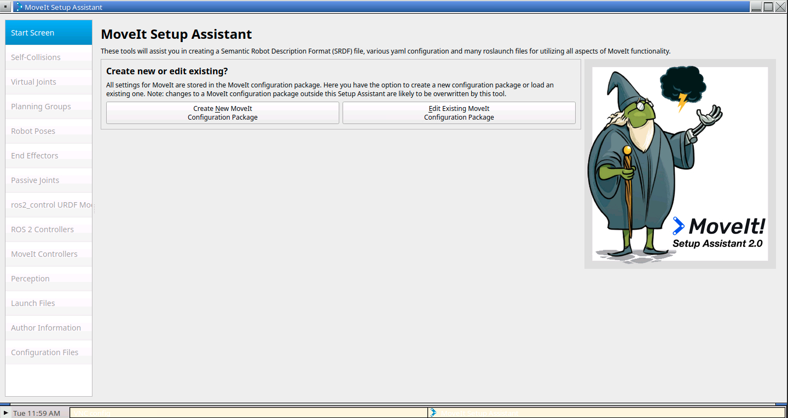
</p>

- **Click on** `Create New MoveIt Configuration Package`.

A new input box will appear, asking for the path to the robot description:

<p align="center">
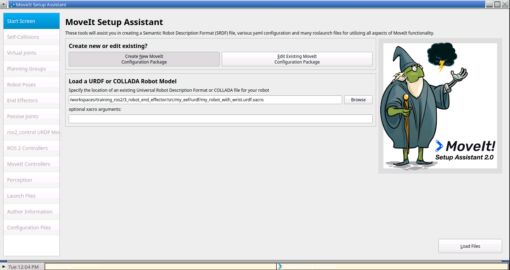
</p>

- **Paste the following value, or search for the folder manually using the** `Browse` **button:**

```sh
/workspaces/training_ros2/3_robot_end_effector/src/my_eef/urdf/my_robot_with_wrist.urdf.xacro
```

- **Click on** `Load Files`.

You should see a Success! message and the gantry robot with the wrist. Now you can also navigate to the other tabs on the left:

<p align="center">
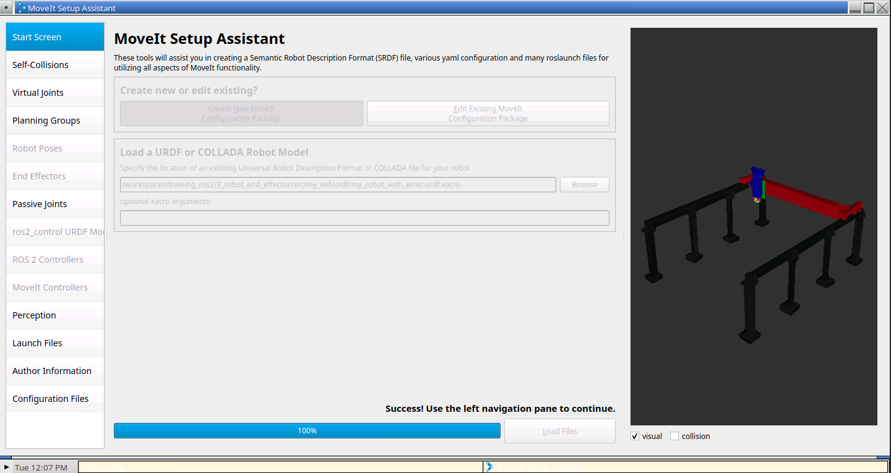
</p>

### Planning groups

- **Click on** `Planning Groups` **>** `Add Group`.

<p align="center">
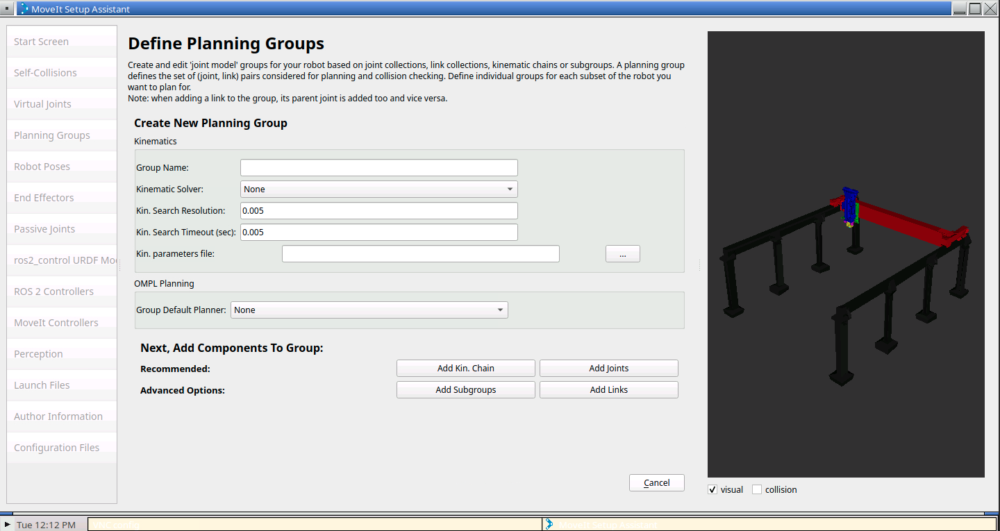
</p>

- **Enter** `Group Name` **as** *"my_gantry_with_wrist"*.
- **Choose** `kdl_kinematics_plugin/KDLKinematicsPlugin` **(the default for MoveIt).**
- **Let** `Kin. Search Resolution` **and** `Kin. Search Timeout` **stay at their default values.**

<p align="center">
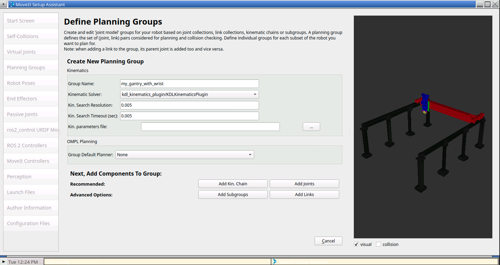
</p>

- **Click on the** `Add Joints` **button.**
- **Click on** `flange_joint`, **hold down the Shift button, and then click on the** `wrist_joint_3`.
- **Click on the** > **button to add these joints into the list on the right.**
- **Click on the** `Save` **button.**

> **:warning:** The joint `flange_joint` is a fixed joint that links the robot `TCP` to the wrist flange. This will be present only if you completed the **[extra section in chapter 3 >](3%20-%20robot%20end%20effector.md#add-more-extensibility-to-the-xacro-file)**


<p align="center">
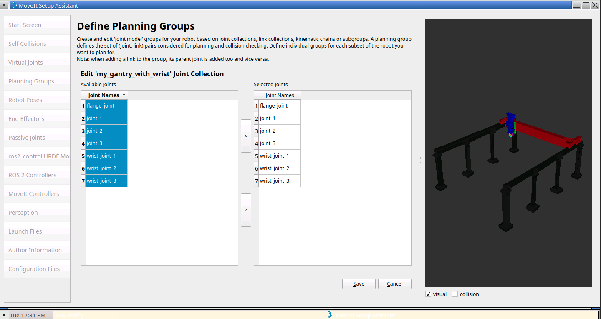
</p>

### Add poses
- **Click on the** `Robot Poses` > `Add Pose`.
- **Save the robot default pose as** *"home".*

<p align="center">
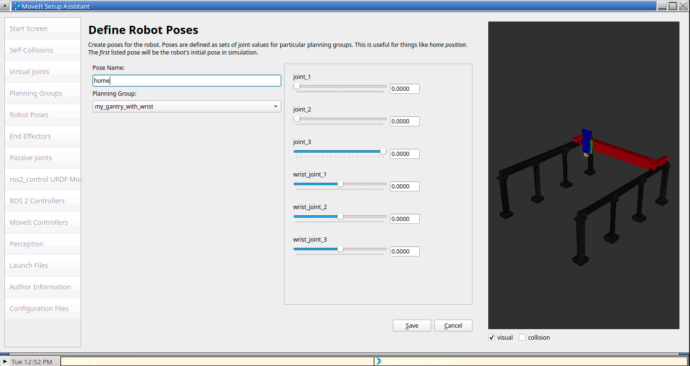
</p>

- **Move the individual joints around and then Save a few more Poses as** `pose_1`, `pose_2`, **etc..**

<p align="center">
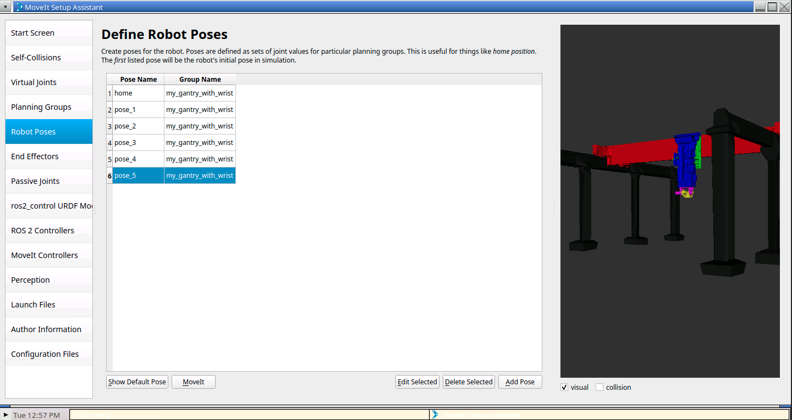
</p>

### Add controllers settings
The `ros2_control URDF Modification` pane helps modify the robot URDF to work with ros2_control. You can just add the default interfaces in this case.

- **Click on the** `ros2_control URDF Modification` > `Add interfaces`.

The `ROS 2 Controllers` pane can be used to auto generate simulated controllers to actuate the robot joints.

- **Click on the** `ROS 2 Controllers` > `Auto Add JointTrajectoryControl..`.

<p align="center">
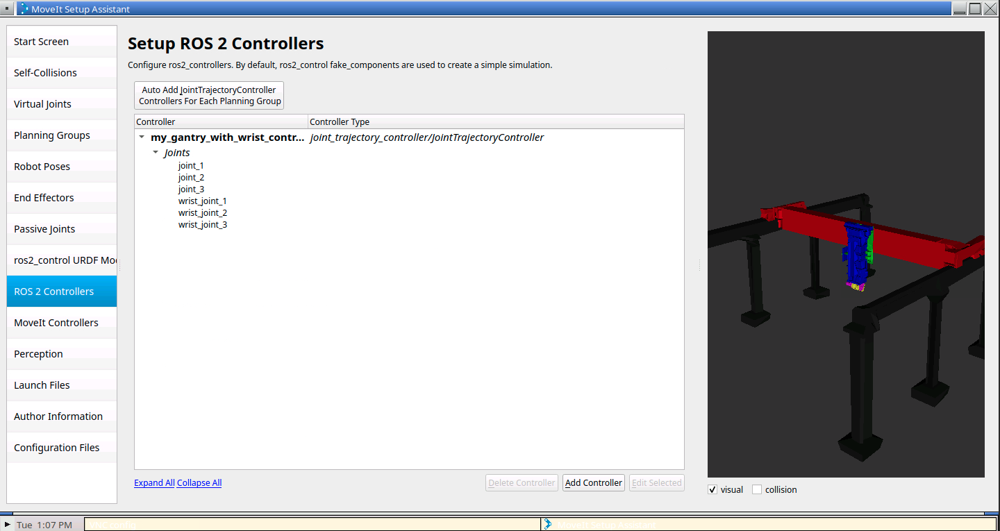
</p>

- **Click on the** `MoveIt Controllers` > `Auto Add FollowJointsTrajectory..`.

<p align="center">
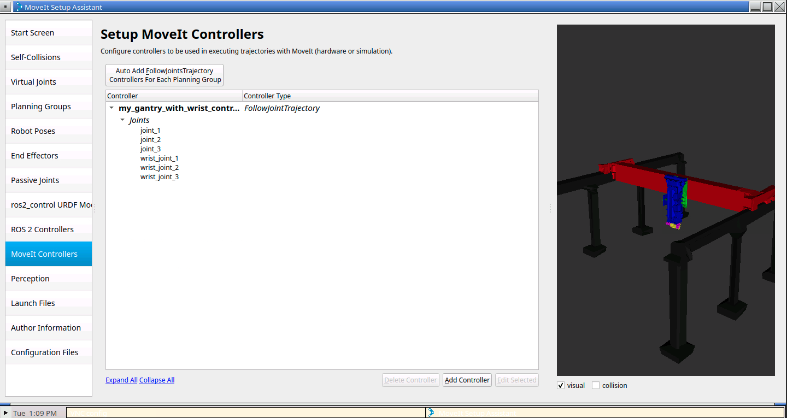
</p>

### Automactic creation of the MoveIt configuration package

The remaining task to perform is adding author information for the automatic creation of the package. In the `Launch Files` pane, all launch files can be left tocked, although we will probably only use the `Demo Launch` one.

- **Click on the** `Author Information` **pane and fill in your data.**

<p align="center">
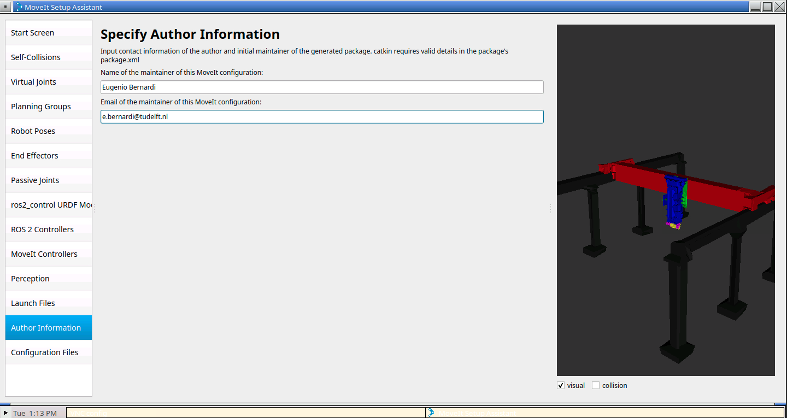
</p>

- **Click on the** `Configuration Files` **pane and browse for the folder** `5_motion_plan`.
- **Create a new folder inside it called** `gantry_moveit_config_pkg` **from within the browsing window popup.**

This should be the look of the page before creation:

<p align="center">
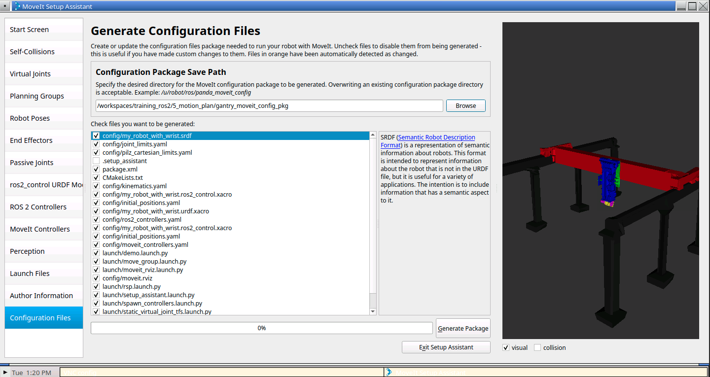
</p>

If everything has gone smoothly, you will receive this confirmation message:

<p align="center">
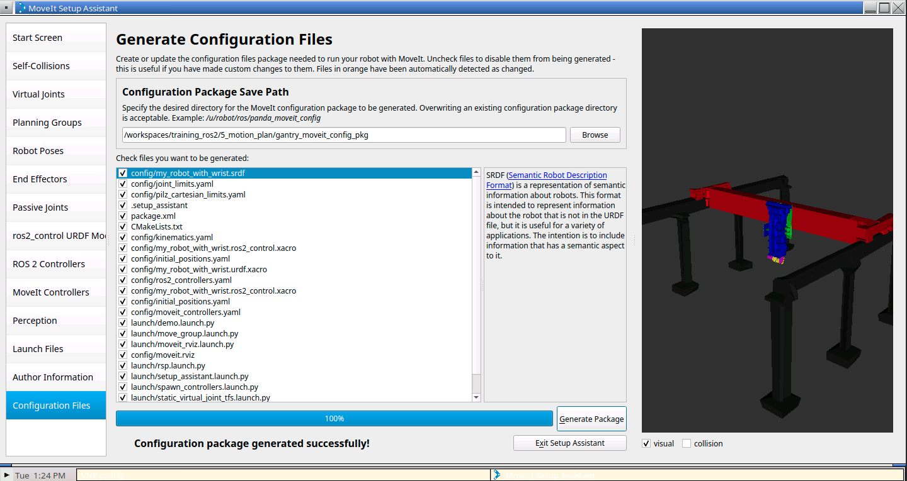
</p>

- **Click on the** `Exit Setup Assistant` **to close the user interface**.

## Compiling and launching the demo

- **To see MoveIt in action, compile the newly auto create package and launch the demo:**

```sh
colcon build --packages-up-to gantry_moveit_config_pkg --merge-install --symlink-install
source install/setup.bash 
ros2 launch gantry_moveit_config_pkg demo.launch.py
```

## References
- https://moveit.picknik.ai/main/doc/examples/setup_assistant/setup_assistant_tutorial.html
